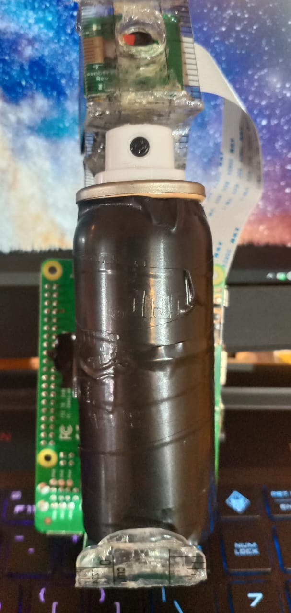

In our opinion, existing methods or pieces of technology in the market for women safety are inadequate and not up to the mark.
    • Most apps/ SoS devices can only help with dealing with the aftermath of the crime.
    • Most weapons like stun guns or pepper spray can only help a woman, ward off the assailant and escape.
Thus, we decided to combine the two and beyond that put our own spin on it, aka innovate it to make it into a totally new product that is capable of not only stopping the crime before it happens but also aid in catching the assailant hopefully in 15-30 mins.
We plan to do so, by making a contraption that can go with the pepper spray which is gps enabled and has a camera  to take picture to the assailant while he is being pepper spray, and upload the picture to google cloud and from there we would fetch the link of the cloud and send it to the loved ones of the woman being harassed so they can call police in a timely manner.
To sum it up,
We plan to make a device that can actually help avoid rape/assault on women instead of just simply sending as SOS call after the crimes have happened.
